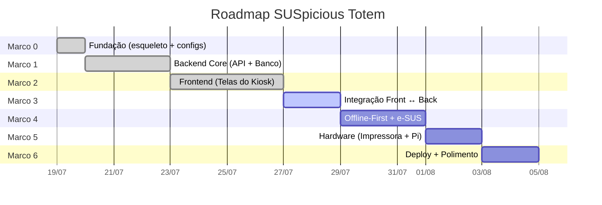

# 🗺️ Marcos de Desenvolvimento — SUSpicious Totem

Estratégia: **Dividir para Conquistar.** Cada marco entrega algo funcional e testável. Nenhum marco depende de hardware real até o Marco 5.

---

## Visão Geral



---

## Marco 0 — Fundação 🏗️ ✅ CONCLUÍDO
> **Objetivo:** Ter o esqueleto do projeto rodando (servidor backend respondendo, frontend exibindo tela vazia).

### Entregáveis
- [x] Criar branch `develop` a partir de `main`
- [x] Inicializar **backend** (FastAPI + estrutura de pastas completa)
  - `main.py` com rota `/health` retornando `{"status": "ok"}`
  - `core/config.py` com Pydantic BaseSettings
  - `.env.example` com template de variáveis
  - `requirements.txt` com dependências iniciais
- [x] Inicializar **frontend** (React + Vite)
  - Scaffold com `create-vite`
  - Tela placeholder "SUSpicious Totem — Em construção"
  - Configuração de PWA (service worker básico)
- [x] Configurar **Alembic** conectado ao SQLite
  - `alembic init`, `env.py` configurado com `target_metadata`
- [x] Criar todos os `__init__.py` e pastas vazias da arquitetura
- [x] Ports: `PrinterPort`, `PacienteRepositoryPort`, `EsusGatewayPort`
- [x] Mocks: `MockPrinter`, `MockEsusGateway`

### ✅ Critério de Conclusão
Backend roda com `uvicorn` e responde no `/health`. Frontend roda com `npm run dev` e exibe a tela placeholder. Alembic executa `upgrade head` sem erros.

---

## Marco 1 — Backend Core (API + Banco) 🧠 ✅ CONCLUÍDO
> **Objetivo:** API funcional com as regras de negócio principais, usando MockPrinter.

### Entregáveis

#### Domain (Entidades)
- [x] `Paciente` — CPF, nome, CNS (Cartão Nacional de Saúde), data de nascimento
- [x] `Senha` — UUID, código legível (ex: `CE-001`), tipo (consulta/vacinação/espontânea), prioridade, status, timestamp
- [x] `Fila` — tipo de atendimento, lista de senhas, senha atual

#### Application (Casos de Uso)
- [x] `GerarSenha` — Recebe tipo de atendimento → gera próxima senha → salva no banco → chama PrinterPort
- [x] `ValidarCPF` — Valida formato → busca no banco local → retorna paciente ou None
- [x] `ChamarProximaSenha` — Avança a fila → retorna a senha chamada
- [x] `ConsultarFilaAtual` — Retorna estado atual de todas as filas

#### Infrastructure
- [x] `PacienteRepository` (SQLModel + SQLite)
- [x] `SenhaRepository`

#### API (Endpoints REST)
- [x] `POST /senhas` — Gerar nova senha
- [x] `GET /senhas/proxima` — Chamar próxima senha
- [x] `GET /filas` — Estado atual das filas
- [x] `GET /pacientes/{cpf}` — Buscar paciente por CPF
- [x] `POST /pacientes` — Cadastrar paciente

#### Testes
- [x] Testes unitários para `GerarSenha`, `ValidarCPF`, `ChamarProximaSenha`
- [x] Testes de integração para repositórios (SQLite in-memory)

### ✅ Critério de Conclusão
Consegue gerar senhas, chamar filas e buscar pacientes via `curl` ou Swagger (`/docs`). Todos os testes passam com `pytest`.

---

## Marco 2 — Frontend (Telas do Kiosk) 🎨 ✅ CONCLUÍDO
> **Objetivo:** Todas as telas do totem navegáveis, com dados mockados no frontend. Visual finalizado.

### Telas

| # | Tela | Descrição |
|:--|:-----|:----------|
| 1 | **Home** | Tela inicial com botões grandes: "Consulta Agendada", "Consulta Espontânea", "Vacinação" |
| 2 | **Inserir CPF** | Teclado numérico virtual para digitar CPF |
| 3 | **Confirmar Paciente** | Exibe nome e dados do paciente para confirmação |
| 4 | **Senha Gerada** | Exibe a senha gerada (ex: `CE-042`) com animação e instrução para aguardar |
| 5 | **QR Code Triagem** | Gera QR Code para o paciente preencher triagem no celular |
| 6 | **Painel de Senhas** | Tela separada (para TV/monitor da recepção) com senhas sendo chamadas |
| 7 | **Tela de Erro** | Mensagem amigável quando a impressora falha ou o sistema está offline |

### Componentes Reutilizáveis
- [x] `BigButton` — Botão touchscreen de alto contraste (min 80px altura)
- [x] `NumPad` — Teclado numérico virtual
- [x] `SenhaCard` — Card exibindo senha com animação de destaque
- [x] `Header` — Cabeçalho com logo SUS e nome da UBS
- [x] `InactivityTimer` — Volta à tela Home após 60s sem interação

### Design
- [x] Paleta de cores acessível (alto contraste WCAG AA)
- [x] Fontes grandes sem serifa (mínimo 18px corpo, 32px títulos)
- [x] Animações de transição entre telas (fade/slide suaves)
- [x] Layout fullscreen sem scrollbar (Kiosk Mode)

### ✅ Critério de Conclusão
Todas as 7 telas navegáveis com dados mockados. Visual aprovado pela equipe. Funciona em tela cheia no Chromium.

---

## Marco 3 — Integração Frontend ↔ Backend 🔗
> **Objetivo:** Frontend consome a API real do FastAPI. Fluxo completo funciona no navegador.

### Entregáveis
- [ ] Camada `services/` no frontend (Axios ou Fetch)
  - `senhaService.js` — `gerarSenha()`, `chamarProxima()`
  - `pacienteService.js` — `buscarPorCPF()`, `cadastrar()`
  - `filaService.js` — `consultarFilas()`
- [ ] Conectar cada tela ao serviço correspondente
- [ ] Tratamento de erros na UI (tela de erro quando API falha)
- [ ] Loading states (spinner enquanto busca paciente)
- [ ] **CORS** configurado no FastAPI para aceitar requests do frontend

### Fluxo E2E Testável
```
[Home] → [Inserir CPF] → [Confirmar Paciente] → [Senha Gerada]
                                                       ↓
                                              [MockPrinter imprime no terminal]
```

### ✅ Critério de Conclusão
O fluxo completo funciona: digitar CPF → confirmar paciente → gerar senha → ver impressão no terminal do backend. Painel de senhas atualiza em tempo real.

---

## Marco 4 — Offline-First + Integração e-SUS 📡
> **Objetivo:** O sistema funciona 100% sem internet. Sincroniza com e-SUS quando possível.

### Entregáveis

#### Offline-First
- [ ] Service Worker cacheando o shell do frontend (PWA)
- [ ] Frontend detecta status online/offline e exibe indicador visual
- [ ] Todas as operações críticas (gerar senha, chamar fila) funcionam sem rede
- [ ] UUIDs como IDs primários em todas as entidades

#### Motor de Sincronização
- [ ] `SyncService` no backend — tenta enviar dados para o e-SUS periodicamente
- [ ] Fila de retry com backoff exponencial (1s → 2s → 4s → ... → 5min max)
- [ ] Log local de eventos pendentes de sincronização
- [ ] Endpoint `GET /sync/status` — retorna quantos registros estão pendentes

#### Integração e-SUS PEC (LEDI APS)
- [ ] `EsusGateway` real — envia fichas via API REST (HTTPS)
- [ ] Autenticação com credenciais geradas no PEC
- [ ] Fallback para `MockEsusGateway` quando em modo desenvolvimento

### ✅ Critério de Conclusão
Desligar o Wi-Fi do computador → gerar senhas normalmente → religar Wi-Fi → dados sincronizam automaticamente. Log de sync visível no terminal.

---

## Marco 5 — Hardware (Impressora + Raspberry Pi) 🖨️
> **Objetivo:** O sistema imprime senhas reais e roda no Raspberry Pi.

### Entregáveis

#### Impressora
- [ ] `EscPosPrinter` — implementação real com `python-escpos`
- [ ] Layout da senha impressa (código, tipo, data/hora, QR code para triagem)
- [ ] Detecção de impressora desconectada → tela de erro amigável
- [ ] Regra `udev` configurada

#### Raspberry Pi
- [ ] Testar sistema completo no Pi (backend + frontend)
- [ ] Chromium em Kiosk Mode apontando para `localhost`
- [ ] Configurar `tmpfs` para proteger cartão SD
- [ ] Script de inicialização automática (systemd service)
- [ ] Desabilitar screen saver e DPMS

### ✅ Critério de Conclusão
Ligar o Raspberry Pi → sistema inicia automaticamente → tela touch funcional → gerar senha → senha sai na impressora térmica.

---

## Marco 6 — Polimento + Deploy Final ✨
> **Objetivo:** Sistema pronto para apresentação no Biochallenge.

### Entregáveis
- [ ] Revisão final de UX (animações, tempos de resposta, feedback visual)
- [ ] Testes de estresse (gerar 100+ senhas, filas simultâneas)
- [ ] Cron job de reinício noturno do Chromium
- [ ] IP estático + SSH configurado
- [ ] Documentação final atualizada (README, ARCHITECTURE)
- [ ] Vídeo de demonstração / screenshots para o Biochallenge
- [ ] Merge `develop` → `main` (release final)

### ✅ Critério de Conclusão
Totem funcional, estável 24h+, com documentação completa. Pronto para apresentação.

---

## 📋 Resumo

| Marco | Nome | Foco Principal | Status |
|:------|:-----|:---------------|:-------|
| **0** | Fundação | Esqueleto de pastas, configs, "Hello World" | ✅ Concluído |
| **1** | Backend Core | API + Banco + Regras de Negócio | ✅ Concluído |
| **2** | Frontend | Todas as telas visuais do totem | ✅ Concluído |
| **3** | Integração | Frontend consumindo API real | 🔄 Próximo |
| **4** | Offline + e-SUS | PWA, sync engine, integração LEDI | ⏳ Pendente |
| **5** | Hardware | Impressora real + deploy no Pi | ⏳ Pendente |
| **6** | Polimento | Estabilidade, testes, documentação final | ⏳ Pendente |
